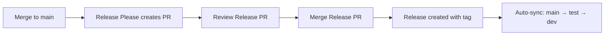

# SSO

Single Sign-On (SSO) service built with Go. This project provides authentication and authorization capabilities using modern SSO protocols.

## Table of Contents

1. [Overview](#overview)
2. [Prerequisites](#prerequisites)
3. [Environment Setup](#environment-setup)
   - [Windows](#windows)
     - [Installing Go 1.25](#installing-go-125)
     - [Installing Task (Taskfile)](#installing-task-taskfile)
     - [Installing GitHub CLI](#installing-github-cli)
     - [Installing Development Tools](#installing-development-tools)
     - [Verifying Your Setup](#verifying-your-setup)
   - [macOS](#macos)
   - [Linux](#linux)
4. [Project Installation](#project-installation)
5. [Available Commands](#available-commands)
6. [Development Workflow](#development-workflow)
7. [Branch Strategy and Pull Requests](#branch-strategy-and-pull-requests)
8. [Release Process](#release-process)
9. [Troubleshooting](#troubleshooting)

---

## Overview

This is a Single Sign-On (SSO) authentication service built with Go 1.25. The project uses:

- **Go 1.25** - Primary programming language
- **Task (Taskfile)** - Modern task runner and build tool (replaces Make)
- **GitHub CLI (gh)** - Command-line tool for GitHub operations
- **golangci-lint** - Fast Go linters aggregator
- **mockgen** - Mock generation tool for testing

The project includes automated workflows for:
- Code formatting and linting
- Running tests
- Creating commits with conventional commit messages
- Managing branches
- Working with Pull Requests and Releases

---

## Prerequisites

Before setting up the development environment, ensure you have:

- **Operating System**: Windows 10/11, macOS, or Linux
- **Go**: Version 1.25 or higher
- **Git**: For version control
- **Task**: Task runner (Taskfile)
- **GitHub CLI (gh)**: For GitHub operations (optional but recommended)
- **Terminal**: PowerShell, CMD, Git Bash, or WSL on Windows

---

## Environment Setup

### Windows

This section provides detailed instructions for setting up the development environment on Windows. 
You can use PowerShell, Command Prompt, or Git Bash. I used Git Bash when did it

#### Installing Go 1.25

**Method 1: Using Official MSI Installer (Recommended)**

1. Visit the [Go download page](https://go.dev/dl/)

2. Download the Windows MSI installer for Go 1.25 or higher:
   - For 64-bit Windows: `go1.25.x.windows-amd64.msi`
   - For 32-bit Windows: `go1.25.x.windows-386.msi`

3. Run the downloaded MSI installer:
   - Double-click the `.msi` file
   - Follow the installation wizard
   - The default installation path is `C:\Program Files\Go` or `C:\Program Files (x86)\Go`

4. The installer automatically configures the PATH environment variable

5. Verify installation:
   - Open a **new** Command Prompt or PowerShell window (important: must be a new window)
   - Run the following command:
   ```bash
   go version
   ```
   - You should see output like: `go version go1.25.x windows/amd64`

**Method 2: Using GoLang IDE**

After installation, verify:
```bash
go version
```

**Configuring GOPATH (if needed)**

Go 1.25 uses modules by default, but you may want to configure GOPATH:

```bash
# Check current GOPATH
go env GOPATH

# Add Go bin directory to PATH (if not already added)
# The default GOPATH is %USERPROFILE%\go on Windows
```

If you need to add `$(go env GOPATH)/bin` to your PATH:

1. Press `Win + X` and select "System"
2. Click "Advanced system settings"
3. Click "Environment Variables"
4. Under "User variables", find and edit "Path"
5. Add: `%USERPROFILE%\go\bin`
6. Click OK to save

---

#### Installing Task (Taskfile)

Task is a modern task runner and build tool that we use instead of Make

**Using Git Bash and that code (Recommended for Windows 10/11)**

```bash
# Create a directory for binaries
mkdir -p ~/bin
# Download last version program
curl -L https://github.com/go-task/task/releases/download/v3.39.2/task_windows_amd64.zip -o /tmp/task.zip
# Open
cd /tmp
unzip -o task.zip
# Move to в ~/bin
mv task.exe ~/bin/
# Add ~/bin in PATH
echo 'export PATH="$HOME/bin:$PATH"' >> ~/.bashrc
# Restart bashrc
source ~/.bashrc
# Return in your folder
# cd -> your source folder
```

After installation, verify:
```bash
task --version
```

**Method 2: Using npm**

If you have Node.js installed:

```bash
npm install -g @go-task/cli
```

Verify:
```bash
task --version
```

**Important:** After installation, **close and reopen your terminal** for PATH changes to take effect.

---

#### Installing GitHub CLI

GitHub CLI (gh) is used for working with GitHub repositories, Pull Requests, and Releases.

**Method: Using Git Bash**

```bash
# Install gh using go install
go install github.com/cli/cli/v2/cmd/gh@latest

# Add Go bin directory to PATH (if not already added)
echo 'export PATH="$(go env GOPATH)/bin:$PATH"' >> ~/.bashrc
source ~/.bashrc

# Verify installation
gh --version
```

**Authenticating with GitHub**

After installation, authenticate with GitHub:

```bash
gh auth login
```

Follow the interactive prompts to authenticate.

---

#### Installing Development Tools

After installing Go, Task, and GitHub CLI, install the required development tools:

```bash
# Navigate to your project directory
# cd -> your source folder

# Install development tools (golangci-lint, mockgen)
task install-tools
```

This command will install:
- **golangci-lint**: Fast Go linters aggregator for code quality checks
- **mockgen**: Mock generation tool for unit testing

The tools will be installed to `$(go env GOPATH)\bin`, which should already be in your PATH.

---

#### Verifying Your Setup

After installing all prerequisites, verify that everything is configured correctly:

```bash
# Navigate to your project directory
cd C:\Users\Family\Desktop\SERGEY\Projects\GITHUB\sso

# Run the dependency check
task check-deps
```

You should see output like:

```
Checking Go...
SUCCESS. Go installed: go version go1.25.x windows/amd64

Checking Task...
SUCCESS. Task installed: Task version: vX.XX.X

Optional: GitHub CLI
SUCCESS. gh installed: gh version X.X.X (YYYY-MM-DD)

===============================================================
All dependencies passed! You can work.
===============================================================
```

If all checks pass, your environment is ready for development!

If any check fails, review the corresponding installation section above.

---

### macOS

> **Note:** This section will be filled when testing deployment on macOS.

**Required tools:**
- Go 1.25 or higher
- Task (Taskfile)
- GitHub CLI (gh)
- Git

---

### Linux

> **Note:** This section will be filled when testing deployment on Linux distributions.

**Required tools:**
- Go 1.25 or higher
- Task (Taskfile)
- GitHub CLI (gh)
- Git

---

## Project Installation

After setting up your environment, clone and set up the project:

```bash
# Clone the repository
git clone https://github.com/AvdienkoSergey/sso.git
cd sso

# Verify dependencies
task check-deps

# Install development tools
task install-tools

# Run tests to ensure everything works
task test

# Build the project
task build
```

---

## Available Commands (looking Taskfile.yml after project Installation)

To see all available commands:

```bash
task help
```

### Common Commands

**Environment and Dependencies:**
```bash
task check-deps      # Check all required dependencies
task install-tools   # Install development tools (golangci-lint, mockgen)
```

**Development:**
```bash
task fmt            # Format code
task lint           # Run linter
task vet            # Static analysis (go vet)
task test           # Run tests
task build          # Build project
task pre-commit     # Run all checks before commit
```

**Working with Commits:**
```bash
task commit         # Interactive commit with type selection
task quick-commit   # Full workflow: pre-commit + add + commit + push
task push-current   # Push current branch to origin
```

**Creating Branches:**
```bash
task branch-feature # Create feature/* branch
task branch-fix     # Create fix/* branch
task branch-hotfix  # Create hotfix/* branch
task branch-chore   # Create chore/* branch
task help-branch    # Show branch naming rules
```

**Working with GitHub:**
```bash
task pr-view        # Open Pull Requests in browser
task release-view   # Open Releases in browser
task repo-view      # Open repository in browser
task actions-view   # Open GitHub Actions in browser
```

---

## Development Workflow

I recommend following this development process to avoid pain when trying to submit your code to our repository.

### 1. Create a New Branch

```bash
# For a new feature
task branch-feature
# Enter feature name when prompted, e.g., "add-oauth"

# For a bug fix
task branch-fix
# Enter fix name when prompted, e.g., "login-error"

# Please use this command to see all variants (feature, fix, hotfix, chore)
task help-branch
```

### 2. Make Your Changes

Edit code, add features, fix bugs...

### 3. Run Pre-commit Checks

```bash
task pre-commit
```

This will run:
- Code formatting (`task fmt`)
- Static analysis (`task vet`)
- Linting (`task lint`)
- Tests (`task test`)

### 4. Commit Your Changes

```bash
task commit
```

This will:
- Prompt you to select commit type (feat, fix, docs, etc.)
- Ask for commit description
- Add all changes
- Create the commit

### 5. Push Your Changes

```bash
task push-current
```

Or use the quick workflow:

```bash
task quick-commit
```

This combines steps 3-5 in one command.

---

## Branch Strategy and Pull Requests

This project follows a structured branching strategy to ensure code quality and proper testing before production deployment.

### Branch Hierarchy

```
feature/fix/hotfix/chore/* → dev → test → main
```

**Branch Purposes:**
- **feature/\***, **fix/\***, **hotfix/\***, **chore/\*** - Development branches for individual features or fixes
- **dev** - Development/integration branch where all features are merged first
- **test** - Testing/staging branch for QA and pre-production testing
- **main** - Production branch with stable, released code

### Creating Pull Requests (Merge Requests)

After you've pushed your changes to your feature/fix/hotfix/chore branch, you need to create Pull Requests to merge your code through the branch hierarchy.

#### Step 1: Create PR from your branch to `dev`

```bash
# Make sure you're on your feature/fix branch
git checkout feature/your-feature-name

# Push your branch if you haven't already
task push-current

# Create Pull Request to dev branch using GitHub CLI
gh pr create --base dev --title "feat: your feature title" --body "Description of your changes"

# Or open Pull Requests in browser and create manually
task pr-view
```

**Using GitHub CLI to create PR:**

```bash
# Interactive mode - will prompt for details
gh pr create --base dev

# Non-interactive mode with all details
gh pr create \
  --base dev \
  --title "feat: add OAuth authentication" \
  --body "This PR adds OAuth 2.0 authentication support with Google and GitHub providers"

# After creating, view your PR in browser
gh pr view --web
```

**Manual creation via browser:**

1. Run `task pr-view` or visit `https://github.com/AvdienkoSergey/sso/pulls`
2. Click "New pull request"
3. Set **base:** `dev` and **compare:** `your-branch-name`
4. Fill in the PR title and description
5. Click "Create pull request"

#### Step 2: After PR is approved and merged to `dev`

Once your PR is merged into `dev`, the next step is to promote changes to the `test` branch.

**Create PR from `dev` to `test`:**

```bash
# Switch to dev branch
git checkout dev

# Pull latest changes
git pull origin dev

# Create PR from dev to test
gh pr create --base test --head dev --title "chore: promote changes to test" --body "Promoting latest features and fixes from dev to test for QA"

# Or use browser
task pr-view
```

#### Step 3: After testing is complete, merge `test` to `main`

Once QA testing is complete on the `test` branch, create a PR to merge into `main`.

**Create PR from `test` to `main`:**

```bash
# Switch to test branch
git checkout test

# Pull latest changes
git pull origin test

# Create PR from test to main
gh pr create --base main --head test --title "chore: release to production" --body "Promoting tested changes to production"

# Or use browser
task pr-view
```

### Complete Workflow Example

Here's a complete example of the entire process:

```bash
# 1. Create a new feature branch
task branch-feature
# Enter: "add-user-profile"

# 2. Make your changes
# ... edit code ...

# 3. Run pre-commit checks, commit, and push
task quick-commit
# Follow prompts to commit with type and message

# 4. Create PR to dev
gh pr create --base dev --title "feat: add user profile page" --body "Implements user profile viewing and editing functionality"

# 5. Wait for review and approval, then merge via GitHub UI

# 6. Switch to dev and create PR to test
git checkout dev
git pull origin dev
gh pr create --base test --head dev --title "chore: promote to test" --body "Promoting user profile feature to test environment"

# 7. After QA approval on test, create PR to main
git checkout test
git pull origin test
gh pr create --base main --head test --title "chore: release to production" --body "Releasing user profile feature to production"

# 8. After merge to main, automatic release process will trigger (see Release Process section)
```

### PR Best Practices

**PR Titles:**
Follow conventional commit format:
- `feat: add new feature`
- `fix: resolve bug in authentication`
- `docs: update README with new instructions`
- `chore: update dependencies`
- `refactor: simplify user service logic`

**PR Descriptions:**
Include:
- Summary of changes
- Why the changes were made
- Any breaking changes
- Testing performed
- Related issues/tickets

**Example PR Description:**
```markdown
## Summary
Adds OAuth 2.0 authentication support for Google and GitHub providers

## Changes
- Implemented OAuth flow with PKCE
- Added provider configuration management
- Created callback handlers
- Updated user model to support OAuth accounts

## Testing
- Manual testing with Google OAuth
- Manual testing with GitHub OAuth
- Unit tests for OAuth service
- Integration tests for callback flow

## Related Issues
Closes #42
```

### Reviewing and Approving PRs

**View PRs:**
```bash
# List all open PRs
gh pr list

# View specific PR
gh pr view 123

# View PR in browser
gh pr view 123 --web
```

**Review PR:**
```bash
# Checkout PR locally for testing
gh pr checkout 123

# Run tests
task test

# Approve PR
gh pr review 123 --approve --body "LGTM! Tests pass."

# Request changes
gh pr review 123 --request-changes --body "Please add unit tests for the new service"

# Comment on PR
gh pr comment 123 --body "Could you add documentation for this feature?"
```

**Merge PR:**
```bash
# Merge PR (requires approval)
gh pr merge 123 --merge

# Squash and merge
gh pr merge 123 --squash

# Rebase and merge
gh pr merge 123 --rebase
```

### Branch Protection Rules

The following branches should have protection rules enabled:

**`main` branch:**
- Require pull request reviews before merging
- Require status checks to pass (CI tests, linting)
- Require branches to be up to date before merging
- Do not allow direct pushes

**`test` branch:**
- Require pull request reviews
- Require CI checks to pass

**`dev` branch:**
- Require CI checks to pass
- Allow direct pushes from approved developers (optional)

---

## Release Process

This project uses **Release Please** for automated semantic versioning and changelog generation.

### How Release Process Works



### Automated Release Flow

1. **When code is merged to `main`:**
   - Release Please GitHub Action triggers automatically
   - Analyzes commit messages since last release
   - Determines version bump based on conventional commits:
     - `feat:` → minor version bump (1.0.0 → 1.1.0)
     - `fix:` → patch version bump (1.0.0 → 1.0.1)
     - `feat!:` or `BREAKING CHANGE:` → major version bump (1.0.0 → 2.0.0)

2. **Release Please creates/updates a Release PR:**
   - PR title: `chore(main): release sso X.Y.Z`
   - Contains updated CHANGELOG.md
   - Contains updated version in relevant files
   - This PR is **NOT** automatically merged - requires review

3. **When Release PR is merged:**
   - GitHub Release is created automatically
   - Git tag is created (e.g., `v1.2.0`)
   - Release notes are generated from CHANGELOG
   - **Automatic branch synchronization triggers**

4. **Automatic branch synchronization:**
   - After release is created, branches are automatically synced
   - `main` → `test` (merge with message: `chore: sync test with main after release vX.Y.Z`)
   - `main` → `dev` (merge with message: `chore: sync dev with main after release vX.Y.Z`)
   - This ensures all branches stay in sync with production

### Viewing Releases

```bash
# View all releases
gh release list

# View latest release
gh release view

# View specific release
gh release view v1.2.0

# Open releases in browser
task release-view
```

### Manual Release (if needed)

In rare cases where you need to create a manual release:

```bash
# Create a new release
gh release create v1.2.0 \
  --title "Release v1.2.0" \
  --notes "Manual release with bug fixes"

# Create a pre-release
gh release create v1.3.0-beta.1 \
  --title "Beta Release v1.3.0-beta.1" \
  --notes "Beta version for testing" \
  --prerelease
```

### Understanding Conventional Commits for Releases

To ensure proper versioning, use conventional commit messages:

**Patch Release (1.0.0 → 1.0.1):**
```bash
fix: resolve login timeout issue
fix: correct validation error message
docs: update installation guide
```

**Minor Release (1.0.0 → 1.1.0):**
```bash
feat: add OAuth authentication
feat: implement user profile management
```

**Major Release (1.0.0 → 2.0.0):**
```bash
feat!: redesign authentication API

BREAKING CHANGE: Auth endpoints now require API version in URL
```

or

```bash
feat: migrate to new authentication system

BREAKING CHANGE:
- Removed legacy /auth/login endpoint
- New endpoint is /v2/auth/login
- API tokens now expire after 24 hours instead of 7 days
```

### Release Checklist

Before merging the Release Please PR:

- [ ] Review CHANGELOG.md for accuracy
- [ ] Verify version number is correct
- [ ] Ensure all features are documented
- [ ] Confirm all tests pass on `main` branch
- [ ] Check that critical bugs are resolved
- [ ] Notify team of upcoming release

After release is created:

- [ ] Verify release appears in GitHub Releases
- [ ] Confirm git tag was created
- [ ] Check that `test` and `dev` branches auto-synced successfully
- [ ] Monitor for any production issues
- [ ] Announce release to stakeholders

### Monitoring Release Automation

```bash
# View GitHub Actions workflows
task actions-view

# Check workflow status
gh run list --workflow=release-please.yml

# View specific workflow run
gh run view <run-id>

# View workflow logs
gh run view <run-id> --log
```

---

## Troubleshooting

### Common Issues on Windows

**Issue: "task: command not found" or "go: command not found"**

Solution:
1. Close and reopen your terminal (important!)
2. Verify PATH is configured correctly
3. Run `echo %PATH%` (CMD) or `$env:PATH` (PowerShell) to check if Go and Task directories are present
4. Reinstall the tool if necessary

**Issue: "golangci-lint: command not found"**

Solution:
```bash
# Install development tools
task install-tools

# Verify GOPATH/bin is in PATH
go env GOPATH

# Add to PATH if needed (see Go installation section)
```

**Issue: Task fails with "command not recognized"**

Solution:
- Make sure you're using a compatible shell (PowerShell, CMD, Git Bash, or WSL)
- Some commands may require Git Bash or WSL on Windows
- Check Taskfile.yml for OS-specific command variations

**Issue: Tests fail on Windows with race detector**

Solution:
- The race detector requires CGO on Windows
- The Taskfile automatically disables `-race` flag on Windows
- This is expected behavior and documented in Taskfile.yml:179-186

**Issue: Git Bash shows "unzip: command not found"**

Solution:
```bash
# Use PowerShell or CMD for manual Task installation, or
# Install unzip for Git Bash via Chocolatey:
choco install unzip
```

**Issue: "gh auth" fails or gh commands don't work**

Solution:
```bash
# Authenticate with GitHub
gh auth login

# Follow the prompts to complete authentication
```

---

For more information about Task commands, run:
```bash
task help
```

For project-specific questions, please open an issue on GitHub.